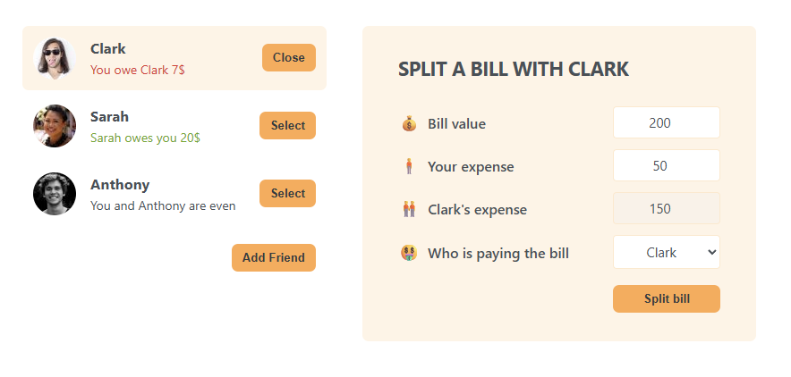

# Eat-n-Split 🍽️

A simple React app that helps you split bills with friends.  
Built while following [Jonas Schmedtmann’s React Course](https://www.udemy.com/course/the-ultimate-react-course/).  

---
## 📷 Screenshots


<p align="center">
  
  
</p>


---

## 🚀 Features
- Add new friends to the list 👥  
- Select a friend to split a bill with  
- Enter the bill amount and who paid what 💰  
- Track balances with each friend (who owes whom)  

---

## 🛠️ Tech Stack
- React (JSX, Components, Props, State, Conditional Rendering)  
- CSS  
- JavaScript (ES6+)  

---

## 📦 Installation & Setup

1. Clone the repository  
   ```bash
   git clone https://github.com/your-username/eat-n-split.git
   cd eat-n-split

2. Install dependencies
   ```bash
   npm install

3. Start the development server
   ```bash
   npm start

4. Build for production
   ```bash
   npm run build

### 🔗 Live Demo (Vercel)
  [Demo Link](https://eat-n-split-sigma-seven.vercel.app/)

### 💻 Github repo
  [Repo Link](https://github.com/AbdalrahmanEmara/eat-n-split)